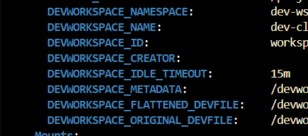

# Dev-cli

The goal of this project is to provide a cli to hasten my dev process and to create interface for thing that actualy dont.

## Eclipse Che

Eclipse che is my main env that allow me to dev in my personal time (and i love it). This project is born from [this issue](https://github.com/eclipse/che/issues/22812) that follow my thinking process of loving project with source openly available.

### What's done (in [4.0.0](https://github.com/batleforc/Dev-cli/releases/tag/0.4.0)) ?

- Start/Restart/stop a workspaces from the CLI (Understand the lifecycle of a workspaces)
- Get my current workspaces (if in one or else choose one)
- List other container (in the current workspace or a choosen one) and if there is get the hability to open a shell inside
- Spawn a shell in one of the container in the workspaces <https://docs.rs/kube/latest/kube/struct.Api.html#method.exec>

###  What's left to do ?

- Restart the workspaces from the local devfile [(How it's done in che-code)](https://github.com/che-incubator/che-code/blob/main/code/extensions/che-remote/src/extension.ts#L75) (A FEATURE THAT I REALLY NEED)
- Quick connect my vscode to the workspaces (code --folder-uri "vscode-remote://k8s-container+context={CONTEXT NAME}+podname={Pod Name}+namespace={Namespace}+name={Container name}+image={Container image}{Path to open in the project}") (Block thread and [prevent workspace to stop](https://github.com/che-incubator/che-code/blob/6e0a908d58cacb380c216dde3af544d75e3913d5/code/extensions/che-api/src/impl/k8s-workspace-service-impl.ts#L57)?)
- Quick connect Idea (jetbrains gateway) if handled by the workspaces

### NotaBene

- To detect DevSpace/Eclipse Che there is some env var that's available.

- You can start/stop with a simple patch [Code Source](https://github.com/che-incubator/che-code/blob/6e0a908d58cacb380c216dde3af544d75e3913d5/code/extensions/che-api/src/impl/k8s-workspace-service-impl.ts#L62)

## CRD handling and generating

You can get the CRD def with `kubectl explain devworkspace` for exemple, the `src/crd` include the Modop to generate new CRD or update existing one based based on the neeeded crd.

## Restart from local Devfile

Has of now the restart in VsCode is not fit for other ide [(How it's done in che-code)](https://github.com/che-incubator/che-code/blob/main/code/extensions/che-remote/src/extension.ts#L75). This way of working need to be tweaked for Idea and futur other ide. To make it easier i found the annotation "che.eclipse.org/che-editor" in the DevWorkspace CRD that include the editor passed on startup (Could be interesting to include the one in .che/che-editor if the other one is not found)

## Dockerfile/DevFile templating

Long story short i would like to include in another submodule/cli close to this one (it's possible that in the futur i pop out this part) a module that would act has a component library who would output a Dockerfile including all your need. Atm i have made the batleforc/che-base that include the base tool that i deemed necessary and made some variant based on it including different tool (sdkman for a full java image, Rust and cargo for a rust variant, etc). BUT i may need in some case to reduce the size of those image (ATM less than 1Go).

##  Choice to be made

- Rust or Golang ? (Most likely to be in rust)
- Lib mode ?

### Why rust ?

Rust is my main language to learn atm. And i have lots of project that im currently doing and some capacity that this project bring will further improve those project.

The choosen main lib is [clap - tutorial](https://docs.rs/clap/latest/clap/_derive/_tutorial/chapter_0/index.html) for the cli part and [kube](https://docs.rs/kube/latest/kube/index.html) for the kubernetes part.

## What i want to learn

- Interact directly with the kubernetes api not throught the mainstream manifest
- Know a lots more of my ide (VsCode) and whats really behind
- Deep dive in my dev env (Eclipse Che)
- [x] (Automated with github action) Create a CI/CD that dont create Docker images but binary for different env (Do i publish the release on github or on a FS ?)
- [x] (Set up allong with the pipeline) Sign commit and a fully fledged Changelog

## Contributing

Has of now, the best choice for contributing and having a ready to dev env is to use a "eclipse che" like env based on the image that i provide.

BUT if you need to make your own here what's needed:

- Rust (latest)
- [Cargo-bump](https://crates.io/crates/cargo-bump)
- [Cocogitto](https://github.com/cocogitto/cocogitto)

## CICD ?

This repo has two CICD:

- Build and Release that will create a release draft on each Tag
- Clippy that will check for possible improvement

### Release

NO TAG SHOULD BE MANUALY MADE !!

To make a tag use :

```shell
cog bump [ --patch | --minor | --major ]
```

Doing it with the cli will:

- Increment the past version depending on the choice made (path/minor/major)
- Change the version in Cargo.toml
- Generate the changelog
- Trigger the pipeline that will create a draft with possible package

#### If you want to undraft the release

- Go to the [Github release page](https://github.com/batleforc/Dev-cli/releases)
- Select the release to undraft
- Give it a name like `0.2.2 - Dalek` and a descrption to your need
- Publish the release and enjoy !!
